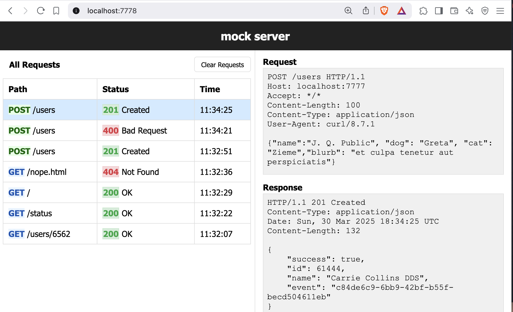

# mock - http server

Mock creates an HTTP server with _mocked_ routes specified from a local file.
It allows for rapid development and testing of (REST) API clients. The routes
are dynamically configured from a watched file. Mock hosts a log of all requests under [http://localhost:7777/mock/](http://localhost:7777/mock/).

For added flexibility, Mock optionally serves a specified directory.

The format of the file is very similar (compatible) to the client specification
of VSCode's [REST Client](https://marketplace.visualstudio.com/items?itemName=humao.rest-client) / IntelliJ's [HTTP Client](https://www.jetbrains.com/help/idea/http-client-in-product-code-editor.html#creating-http-request-files).

## Build/Install

    make

## Run

    $ mock --help
    Start mock server with REST Client file, directory or <stdin>.
    mock [flags] [input_file]
      -l string
            URL path to view the request log (default "/mock")
      -p int
            port (default 7777)

1. Mock API: `mock examples/user.http` or `cat my.http | mock` or even `mock < my.http`
2. Serve Directory: `mock .` NOTE: can't combine serving a directory with serving `.http` files.

If you're interested in developing `mock` _itself_, simply start `mock` with:

    go run cmd/main.go examples/user.http

## Response File

Responses are mocked in a text file. Responses start with `###`, specify optional
parameters, then the HTTP Method and PATH, followed by optional headers, an
empty line and an optional body. Parameters in the path may be specified by preceding
the parameter with a COLON. To substitute this parameter in the response, surround
the name with double curly brackets.

Examples:

    ### Return user
    GET /users/:id
    content-type: application/json

    {
        "id": "{{id}}"
        "name": "John Dough",
        "email": "john@dough.com"
    }

    ### Delete user
    # @status=204
    DELETE http://localhost:1234/users/:id

In general, syntax is:

    ### Response Name
    # @var=value (understands @delay, @status, @file)
    HTTP_METHOD URL
    header      (optional zero or more)
                (empty line, required if body specified)
    body line 1 (optional)
    body line 2 (optional)

    ### Response 2
    ...

### Response Variables

Variables are specified after `###`, are optional, and are defined one per line.

1. `# @delay=500ms` delays response (defaults to 0, golang duration syntax)
2. `# @status=201` defines http status code (defaults to 200)
3. `# @file=index.html` specifies body from external file (defaults to unspecified)

### Global Variables

May specify global variables that can then be substituted in responses
with `{{$name}}`. This are usually specified at the top of the file.

`@name=value`

### Path Variables

Variables may be defined in the path, preceded by a colon. For any path variable
defined in the path, `{{$name}}` in the body will be replaced with the value
of the variable.

    ### say hello
    GET /hello/:name
    content-type: text/plain

    Hello {{$name}}!

### Headers

Headers are optional. By default, every response will respond
with `content-type: "text/html; charset=utf-8"`.

**NOTE** While it'd be nicer to default content type to `application/json`,
HTTP Client plugins only highlight JSON bodies if the content-type
is specified.

### Variables

Besides replacing path variables in the body or header e.g. `{{id}}`, the following
variables will be dynamically generated with [faker](https://github.com/jaswdr/faker)
and replaced in the body. The dollar sign is optional.

- `{{$name}}`
- `{{$firstName}}`
- `{{$lastName}}`
- `{{$user}}`
- `{{$email}}`
- `{{$phone}}`
- `{{$url}}`
- `{{$file}}`
- `{{$server}}`
- `{{$hash}}`
- `{{$bool}}`
- `{{$integer}}`
- `{{$float}}`
- `{{$guid}}`
- `{{$uuid}}`
- `{{$timestamp}}`
- `{{$isoTimestamp}}`
- `{{$sentence}}`
- `{{$paragraph}}`
- `{{$article}}`

## Multiple Responses

The same Method and Path can be specified. Each duplicate Method / Path adds
a new response to the entry. As you request the same API, different responses
are returned in a round-robin fashion.

For example (not actual format):

    ### response 1
    # @status=201
    POST /users
    { "id": 5 }

    ### response 2
    # @status=201
    POST /users
    { "id": 6 }

    ### response 3
    # @status 201
    POST /users
    { "id": 0 }

Will return the status codes `201`, `201`, `400` and responses `{ "id": 5 }`,
`{ "id": 6 }`, `{ "id": 0 }` in order as you issue
`curl -XPOST http://localhost:8080/users` requests.

## Features

- [x] embedded web server displays log of all requests/responses. Uses [ngrok](https://ngrok.com) as inspiration.
- [x] easy api specification similar to [HTTP Client](https://www.jetbrains.com/help/idea/http-client-in-product-code-editor.html)
- [x] specify multiple api files from command line
- [x] include external files
- [x] path variables
- [x] autoload file changes
- [x] multiple responses per Method / Path
- [x] dockerized
- [x] add {{$body}} variables similar to what http client supports
- [x] Use Go lang text templates instead of ReplaceAll()

## Ideas

- [ ] edit mock http file in api events page
