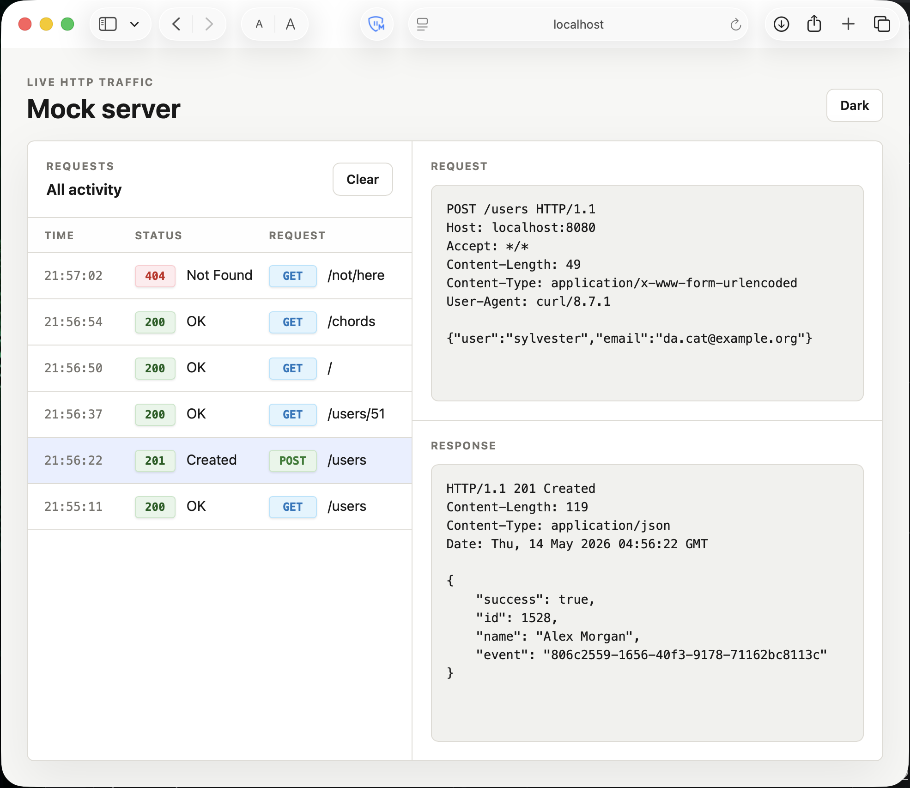

# mock

`mock` turns REST Client-style `.http` files into a local HTTP server.

It is meant for the useful middle ground between hand-written test doubles and
a real backend: describe the routes you need, start the server, point your client
at `localhost`, and inspect the traffic in a small web UI.

## Quick Start

Run the example API:

```sh
go run . examples/user.http
```

The server prints the routes it loaded, then listens on `:8080`.

```sh
curl http://localhost:8080/users/42
curl -X POST http://localhost:8080/users
curl http://localhost:8080/names?type=cat
```

Open the request log at [http://localhost:8080/mock/](http://localhost:8080/mock/).
The UI shows each request and response with raw HTTP-style details, which is
handy when you want to see exactly what your client sent.



You can also pipe a request file through stdin:

```sh
cat examples/user.http | go run .
```

## Installing And Building

Common development commands:

```sh
make test
make all
make build
```

`make build` installs the `mock` binary into `GOBIN`, or `GOPATH/bin` when
`GOBIN` is not set.

After building:

```sh
mock -p 9090 -l inspect examples/user.http
```

That serves the mock API on `:9090` and the request log at
`http://localhost:9090/inspect/`.

## Docker

Build the image:

```sh
docker build -t mock .
```

Run it with a `.http` file from your host machine:

```sh
docker run --rm \
  -p 8080:8080 \
  -v "$PWD/examples/user.http:/mock/user.http:ro" \
  mock /mock/user.http
```

The bind mount keeps the request file outside the image. Rebuild the image only
when the `mock` binary or static UI changes; edit the host `.http` file and
restart the container to load new mock routes.

If the request file uses `$file` response bodies, mount the whole directory so
relative file references are available inside the container:

```sh
docker run --rm \
  -p 8080:8080 \
  -v "$PWD/examples:/mock/examples:ro" \
  mock /mock/examples/user.http
```

## CLI

```text
mock [-l mock] [-p 8080] <file.http> [file.http...]
cat file.http | mock
```

Flags:

- `-p`: HTTP port to listen on. Defaults to `8080`.
- `-l`: URL path for the request log UI. Defaults to `mock`, served as `/mock/`.

You can pass one or more `.http` files. When no files are passed, `mock` reads
from stdin. Empty input fails fast with an error that points at the expected
request-section format.

## Request File Format

Each response starts with `###`, followed by a name, optional variables, an HTTP
request line, optional response headers, a blank line, and an optional body.

```http
### Return user
# $status=200
GET /users/:id
Content-Type: application/json

{
  "id": "{{$id}}",
  "name": "{{$name}}",
  "requestId": "{{$uuid}}"
}

### Delete user
# $status=204
DELETE /users/:id
```

The request target may be a path or a full URL. Only the path and query string
are used for matching.

## Variables

Variables live in comments directly below the `###` line:

```http
# $status=201
# $delay=500ms
# $file=users.json
```

Supported control variables:

- `$status`: response status code. Defaults to `200`.
- `$delay`: response delay parsed with Go duration syntax, such as `250ms` or `2s`.
- `$file`: response body file, resolved relative to the `.http` file.

`$file` paths must be relative and cannot contain `..` path segments. If no
explicit `Content-Type` header is set, file-backed responses infer it from the
file extension when possible.

## Placeholders

Response bodies can contain `{{$name}}` placeholders. `mock` resolves them from:

- Path parameters, such as `:id` in `/users/:id`.
- Query parameters, such as `type` in `/names?type=cat`.
- Variables declared in comments, such as `$delay`.
- Built-in generated values.

Useful generated values:

```text
{{$name}}          {{$firstName}}      {{$lastName}}
{{$user}}          {{$email}}          {{$phone}}
{{$url}}           {{$server}}         {{$hash}}
{{$bool}}          {{$integer}}        {{$float}}
{{$uuid}}          {{$timestamp}}      {{$isoTimestamp}}
{{$sentence}}
```

Unknown placeholders resolve to an empty string.

## Matching

Routes match on HTTP method, path, and any query parameters declared in the
`.http` file.

```http
### Cat names
GET /names?type=cat
Content-Type: application/json

{"type":"{{$type}}","names":["miso","taco"]}
```

`GET /names?type=cat` matches. `GET /names?type=dog` does not.

Path parameters are introduced with `:`.

```http
### User profile
GET /users/:id/profile
Content-Type: application/json

{"id":"{{$id}}"}
```

## Multiple Responses

If more than one response has the same method and URL, `mock` rotates through
the matching responses in file order. This is useful for retry paths and stateful
client behavior without building a stateful fake server.

```http
### First create succeeds
# $status=201
POST /users
Content-Type: application/json

{"id":1}

### Second create fails
# $status=400
POST /users
Content-Type: application/json

{"error":"duplicate user"}
```

Repeated `POST /users` requests return `201`, then `400`, then `201` again.

## Development

This repository is intentionally small:

- `main.go` wires CLI flags, input loading, and HTTP server startup.
- `restclient/` parses `.http` files.
- `mockhttp/` matches requests, renders responses, and streams request-log events.
- `static/` contains the request log UI.
- `examples/` contains request files you can run locally.

Before sending a change around:

```sh
make all
```
