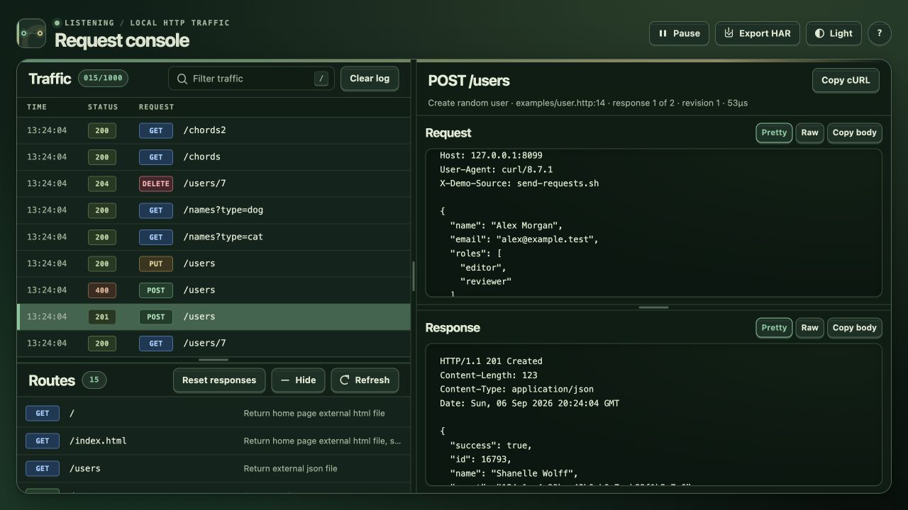

# mock

[](https://github.com/sspencer/mock/actions/workflows/go.yml)
[](https://github.com/sspencer/mock/releases/latest)
[](LICENSE)

`mock` turns REST Client-style `.http` files into a local HTTP server with hot
reload and a request-log UI. It is a single binary for the gap between
hand-written test doubles and a real backend — not a replacement for WireMock,
Prism, or Mockoon, and not the Go unit-test mocking libraries (gomock, mockery).

## Install

Requires [Go](https://go.dev/dl/) 1.26 or newer:

```sh
go install github.com/sspencer/mock@v0.1.4
mock -version
```

Binaries for Linux, macOS, and Windows are on the
[Releases](https://github.com/sspencer/mock/releases) page. Docker instructions
are [below](#docker). To build from a clone, see [Building From Source](#building-from-source).

This binary is named `mock`. If you already have another `mock` on your `PATH`,
the new one will shadow it or be shadowed, depending on install order.

## Quick Start

Run the example API:

```sh
go run . examples/user.http
```

The server prints a short banner with the listen address, the admin UI URL, and
whether it is watching files, then the route list, and listens on `127.0.0.1:8080`
by default:

```text
starting mock HTTP server on 127.0.0.1:8080
admin UI at http://127.0.0.1:8080/mock/
watching request files for changes
Available mock methods:
  GET     /                              Return home page external html file
  POST    /users                         Create random user
  GET     /users/:id                     Return any user
```

While it is running, it watches the given `.http` file(s) and any `$file`
response bodies they reference. Save a file and the server reloads the routes
and reprints the updated method list. A failed reload keeps the previous routes
and logs the error.

```sh
curl http://localhost:8080/users/42
curl -X POST http://localhost:8080/users
curl http://localhost:8080/names?type=cat
```

Open the request console at [http://localhost:8080/mock/](http://localhost:8080/mock/).
The responsive UI shows each request and response with raw HTTP-style details,
a collapsible live-routes panel, filter/pause/clear controls, HAR export, light
and dark themes, and a Help dialog that explains those controls.

To populate the console during UI development, start the server with
`examples/user.http`, then run this Bash/curl script in another terminal:

```sh
./examples/send-requests.sh          # MOCK_PORT, or 8080 if unset
./examples/send-requests.sh -p 9000  # overrides MOCK_PORT
```

It sends 15 requests across the example routes, including JSON request bodies,
the rotating `201`/`400` responses, a `204` deletion, and the delayed response.
It prints status/timing summaries and leaves response bodies for inspection in
the console. Rerun it whenever you need more traffic.



*Dark-mode request console populated with `examples/send-requests.sh`, showing a successful POST request and its response.*

You can also pipe a request file through stdin:

```sh
cat examples/user.http | go run .
```

## Building From Source

Common development commands:

```sh
make test
make all
make build
```

`make build` always writes the `mock` binary into `GOBIN`, or `GOPATH/bin` when
`GOBIN` is not set. `make` / `make all` does the same after tests pass, even if
Make thinks the sources are unchanged. The binary reports `git describe` via
`-version` when built this way.

After building:

```sh
mock -p 9090 -b 127.0.0.1 -l inspect examples/user.http
```

That serves the mock API on `127.0.0.1:9090` and the request log at
`http://127.0.0.1:9090/inspect/`.

```sh
mock -version
```

## Docker

Build the image:

```sh
docker build -t mock .
```

Run it with a `.http` file from your host machine. Containers must bind
`0.0.0.0` so published ports are reachable from the host (`-b` defaults to
localhost):

```sh
docker run --rm \
  -p 8080:8080 \
  -v "$PWD/examples/user.http:/mock/user.http:ro" \
  mock -b 0.0.0.0 /mock/user.http
```

The bind mount keeps the request file outside the image. Rebuild the image only
when the `mock` binary or static UI changes. Because the file is mounted from
the host, edits to the host `.http` file are picked up by the running container
and reloaded automatically.

If the request file uses `$file` response bodies, mount the whole directory so
relative file references are available inside the container:

```sh
docker run --rm \
  -p 8080:8080 \
  -v "$PWD/examples:/mock/examples:ro" \
  mock -b 0.0.0.0 /mock/examples/user.http
```

## CLI

```text
mock [flags] <file.http> [file.http...]
mock [flags] <directory>
cat file.http | mock
mock -version
```

Flags:

| Flag | Default | Description |
|------|---------|-------------|
| `-p` | `8080`, or `MOCK_PORT` | HTTP port |
| `-b` | `127.0.0.1` | Bind address. Use `0.0.0.0` to listen on all interfaces |
| `-l` | `mock` | URL path for the request-log UI (`/mock/`) |
| `-cors` | (off) | `Access-Control-Allow-Origin` value (`*` or an origin). Only browser preflight `OPTIONS` are short-circuited |
| `-cert` / `-key` | (off) | Enable HTTPS with the given certificate and key |
| `-version` | | Print version and exit |

If `-p` is omitted, `mock` uses the `MOCK_PORT` environment variable when it
is set. An explicit `-p` flag always wins.

You can pass one or more `.http` files. When no files are passed, `mock` reads
from stdin. Empty input fails fast with an error that points at the expected
request-section format.

Request files passed on the command line are watched for changes, including
relative `$file` response bodies. On save, `mock` reloads those files, swaps in
the new routes without restarting the process, and prints the updated route list.
SIGINT/SIGTERM shut the server down cleanly and stop the file watcher.

If you pass a single directory, `mock` serves that directory as a static file
server from `/` instead of loading mock routes or the request-log UI.

## Request File Format

**Headers after the request line are response headers.** To match incoming
request headers such as `Authorization`, `Cookie`, or `Accept`, use
`# $header.Name=value` above the request line — not a header below it.
`Content-Type` after the request line is the usual way to set the mock response
content type. `mock` warns at load time if a well-known incoming header is used
as a response header without a matching `$header.*` matcher.

Each response starts with `###`, followed by a name, optional variables, an HTTP
request line, optional **response** headers, a blank line, and an optional body.

```http
### Return user
GET /users/:id
Content-Type: application/json

{
  "id": "{{$id}}",
  "name": "{{$name}}",
  "requestId": "{{$uuid}}"
}

### Delete user
# $status=204
DELETE /users/:id
```

The request target may be a path or a full URL. Only the path and query string
are used for matching.

### Supported dialect

`mock` supports a practical subset of JetBrains REST Client / `.http` files:

| Supported | Not supported |
|-----------|----------------|
| `###` named sections | `@name` / request separators beyond `###` |
| `# $var=value` control variables | Environment files / `{{env}}` from IDE |
| Request line `METHOD /path` | Full multi-step scripts |
| Response headers after the request line | Separate request vs response documents |
| `# $header.Name=value` request header matchers | Body-content matchers |
| `{{$placeholder}}` in bodies and response headers | Imports of other `.http` files |
| `$file` relative body files | Absolute `$file` paths |

Inline bodies normalize line endings to LF and discard trailing blank lines.
A line beginning `###` is always a section boundary, including within a body.
Use a `$file` dependency for content that must preserve line endings, trailing
whitespace, or literal section delimiters. Individual inline lines are limited
to 1 MiB. Malformed queries, invalid headers, and invalid control directives
produce source-and-line errors; a failed reload retains the working routes.

## Variables

Variables live in comments directly below the `###` line:

```http
# $status=201
# $delay=500ms
# $file=users.json
# $header.Authorization=Bearer secret
```

Supported control variables:

- `$status`: response status code. Defaults to `200`. The supported final status range is `200`–`999`; invalid values are load errors.
- `$delay`: response delay parsed with Go duration syntax, such as `250ms` or `2s`. Negative or invalid durations are load errors.
- `$file`: response body file, resolved relative to the `.http` file.
- `$header.Name=value`: require the incoming request to include that header. Use `*` as the value to accept any non-empty header.

`$file` paths must be relative and cannot contain `..` path segments. If no
explicit `Content-Type` header is set, file-backed responses infer it from the
file extension when possible. Placeholder expansion requires a text, JSON, XML,
or JavaScript content type (explicit or inferred) and valid UTF-8 text without
binary control bytes. Other files are served as raw bytes. Symlinks cannot escape
the directory containing the `.http` file.

## Placeholders

Response bodies **and response headers** can contain `{{$name}}` placeholders.
`mock` resolves them from:

- Path parameters, such as `:id` in `/users/:id`.
- Query parameters, such as `type` in `/names?type=cat`.
- Variables declared in comments, such as `$delay`.
- Built-in generated values.

Path parameters take precedence over query parameters with the same name.
Variable names may contain dots and hyphens after their first character.
Unknown placeholders remain literal and produce load-time warnings; query
parameters supplied only at request time can resolve those warnings at runtime.
Inside JSON strings, inserted values are JSON-escaped. Outside strings, values
are inserted literally, so numeric and boolean placeholders retain their types.
Response headers containing invalid characters after expansion return an error.

Useful generated values:

```text
{{$name}}          {{$firstName}}      {{$lastName}}
{{$user}}          {{$email}}          {{$phone}}
{{$url}}           {{$server}}         {{$hash}}
{{$bool}}          {{$integer}}        {{$float}}
{{$uuid}}          {{$guid}}           {{$timestamp}}
{{$isoTimestamp}}  {{$file}}           {{$sentence}}
{{$paragraph}}     {{$article}}
```

Generated values are random faker data and are recalculated each time a
response body is rendered.

Unknown placeholders resolve to an empty string.

## Matching

Routes match on HTTP method, path, any query parameters declared in the
`.http` file, and any `$header.*` matchers.

```http
### Cat names
GET /names?type=cat
Content-Type: application/json

{"type":"{{$type}}","names":["miso","taco"]}
```

`GET /names?type=cat` matches. `GET /names?type=dog` does not.

Path parameters are introduced with `:`.

```http
### User profile
GET /users/:id/profile
Content-Type: application/json

{"id":"{{$id}}"}
```

### Header matching

```http
### Secure read
# $header.Authorization=Bearer secret
GET /secure
Content-Type: application/json

{"ok":true}
```

## Multiple Responses

If more than one response has the same method and URL (including across multiple
input files, in load order), `mock` rotates through the matching responses.
This is useful for retry paths and stateful client behavior without building a
stateful fake server.

```http
### First create succeeds
# $status=201
POST /users
Content-Type: application/json

{"id":1}

### Second create fails
# $status=400
POST /users
Content-Type: application/json

{"error":"duplicate user"}
```

Repeated `POST /users` requests return `201`, then `400`, then `201` again.
Use **Reset responses** to restart rotation counters. **Clear log** only removes traffic.

## Admin UI And API

The UI is mounted under `-l` (default `/mock/`):

| Path | Purpose |
|------|---------|
| `/mock/` | Request log UI |
| `/mock/events` | Server-sent events stream (with event `id` / `Last-Event-ID`) |
| `/mock/clear` | `POST` clears stored events without changing rotation counters |
| `/mock/reset` | `POST` resets response sequences without clearing traffic |
| `/mock/state` | `GET` active revision, route count, last successful reload, and reload error |
| `/mock/routes` | `GET` route configuration, including source location, match headers, status, delay, and body preview |

**Path conflicts:** the admin mount is reserved and takes precedence over mock
routes beneath it. Keep API routes outside that mount, or change `-l`.

UI features: theme toggle, filter, pause stream, independent clear/reset controls,
HAR export, a Help dialog, and a routes panel that refreshes after hot-reload.
Both administrative POST endpoints require `X-Requested-With` or JSON
`Content-Type` (or a same-origin browser request), and reject cross-origin requests.

### Resizing and mobile navigation

Drag the vertical divider to enlarge the traffic list or inspector. Horizontal
dividers resize traffic versus routes and request versus response. Divider sizes
are remembered locally. Keyboard users can focus a divider and use arrow keys,
Shift+arrow for larger steps, or Home/End. Double-click restores the default.
On narrow screens, selecting traffic or a route opens the inspector; use
**Back to traffic & routes** to return to the list.

### Inspecting requests and routes

- **Pretty / Raw** formats valid, complete JSON or shows the original captured
  content. Headers remain visible, and binary/truncated bodies are labeled.
- **Copy body** copies original captured text; binary captures offer **Copy base64**.
- **Copy cURL** produces a shell-quoted command including captured headers and
  complete text bodies. Incomplete or binary request bodies show an explanation
  instead of producing a misleading replay command. Copied credentials are included.
- Matched requests show the fixture name, source file/line, configuration revision,
  selected response position, and elapsed time. Unmatched requests show up to five
  nearby routes with method, path, query, and header mismatch explanations.
- Select a configured route to inspect its match requirements, response headers,
  variables, status, delay, and body template or file reference. File contents
  are not loaded into the route preview; large inline previews are truncated.
- Failed reloads retain active routes and show an error banner. The banner is
  hidden during normal operation to leave more room for traffic and details.
Pause freezes the table while buffering the latest 1,000 new requests. Resume
shows that traffic; the status indicates how many older paused requests were
omitted. The **Clear log** button clears server history across connected tabs
without changing response rotation. Traffic arriving after the clear boundary remains.

SSE cursors include a server session and sequence number. Slow subscribers
reconnect to replay retained events; a history gap or restart emits a `reset`
event before replay. Clear emits a `clear` event. Request events include the selected route,
sequence position, and configuration revision (or mismatch candidates). History is limited to 1,000
events; gaps are reported rather than silently hidden. Event bodies include
separate byte counts, truncation metadata, and base64 encoding for binary data.

Export HAR downloads captured requests, including their actual HTTP/HTTPS
scheme, byte sizes and binary response encoding. Capture is limited to 64 KiB
per body. HAR extension fields mark truncated bodies and binary requests; these
are diagnostic captures, not complete replay fixtures. Only total server handler
time is measured, so individual network timing phases remain unknown.

## CORS And TLS

```sh
mock -cors '*' examples/user.http
mock -cert cert.pem -key key.pem -p 8443 examples/user.http
```

`-cors` adds CORS headers to mock responses (or static-directory responses),
including `Vary: Origin`. Browser preflights (`OPTIONS` with
`Access-Control-Request-Method`) return `204` and reflect requested headers.
Other `OPTIONS` requests run the mock route. Admin endpoints are excluded from
CORS, including when `-cors '*'` is used. Cross-origin clear requests are rejected.

With `-cert`/`-key`, the startup banner prints `https://` for the admin UI.
Binding to all interfaces (`-b 0.0.0.0`) prints a warning: the admin UI is
unauthenticated and request logs may include `Authorization` headers and bodies.

Normal HTTP writes have a 30-second budget beginning after any configured
response delay. SSE writes have a renewable 10-second deadline and idle streams
send heartbeats. Shutdown stops accepting connections and allows 400 ms for
active requests before closing remaining connections.

## Development

This repository is intentionally small:

- `main.go` / `watch.go` / `version.go` wire CLI flags, input loading, watching, and lifecycle.
- `restclient/` parses `.http` files.
- `mockhttp/` matches requests, renders responses, and streams request-log events.
- `static/` contains the request log UI (embedded at build time).
- `examples/` contains request files you can run locally.
- `docs/recommendations.md` tracks improvement history.

Before sending a change around:

```sh
make verify
```

`make fmt` formats Go files explicitly; verification never rewrites them.
`make all` also installs the binary. Dashboard tests require Node.js 22+.

See [CONTRIBUTING.md](CONTRIBUTING.md) for setup and pull-request notes. Release
history is in [CHANGELOG.md](CHANGELOG.md).
